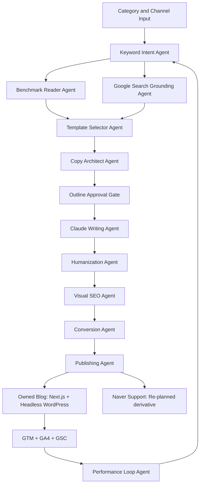

# SEO Content Loop Harness Blueprint

## Summary

This system creates Korean SEO blog content that is designed to rank, read well,
and convert. It uses a loop architecture: category and keyword research produce
a content brief, the writing and image agents create a channel-specific article,
quality gates validate SEO and human tone, publishing adapters ship the content,
and GSC/GA4/GTM data feeds the next content decision.

## Node Table

| Layer | Node | Responsibility | Output |
| --- | --- | --- | --- |
| Input | Category Selector | Choose owned blog or Naver support channel, domain, audience, and conversion goal. | `content_request` |
| Research | Keyword Intent Agent | Find search-intent shape, keyword cluster, and volume/trend candidates. | `keyword_brief` |
| Benchmark | Benchmark Reader Agent | Parse reference URLs for title/meta, H tags, schema, ALT, CTA, and image patterns. | `benchmark_patterns` |
| Grounding | Google Search Grounding Agent | Check Search Central, spam, helpful content, structured data, canonical, sitemap, and image rules. | `seo_quality_gates` |
| Planning | Template Selector Agent | Pick one of several intent templates instead of forcing one blog format, including IT/AX-specific flows. | `article_template` |
| Writing | Copy Architect Agent | Create H1/H2/H3, conclusion-first flow, evidence slots, image slots, HTML export structure, and CTA placement. | `content_architecture` |
| Approval | Outline Approval Gate | Show TOC, image placement, and HTML export structure before the full article is reviewed. | `outline_approval` |
| Generation | Claude Writing Agent | Generate long-form Korean article copy from the architecture. | `draft_article` |
| Humanization | Humanization Agent | Apply an im-not-ai inspired fast gate for translationese, AI signature phrases, mechanical connectors, rhythm uniformity, and over-polish risk. | `humanized_article`, `humanization_audit` |
| Visuals | Visual SEO Agent | Create image prompts, ALT, filenames, dimensions, and placement plan. | `image_briefs` |
| Conversion | Conversion Agent | Connect the reader problem to the brand/product and lead form. | `cta_block` |
| Publishing | Publishing Agent | Produce WordPress/Next.js payloads and Naver derivative instructions. | `publish_payload` |
| Tracking | Tracking Agent | Emit `content_id`, dataLayer events, GA4 key event map, and GSC URL checks. | `measurement_plan` |
| Learning | Performance Loop Agent | Strengthen successful keyword/template/CTA patterns and weaken weak ones. | `next_strategy` |

## Flow

## Data Tables

| Table | Purpose | Key Fields |
| --- | --- | --- |
| `content_runs` | One generated article loop. | `content_id`, `channel`, `category`, `primary_keyword`, `template_id`, `status` |
| `keyword_research` | Keyword and trend evidence. | `content_id`, `keyword`, `intent`, `volume_band`, `trend_score`, `source_url` |
| `benchmark_pages` | Reference-page SEO structure. | `url`, `title`, `h1`, `h2_count`, `schema_types`, `image_alt_score`, `cta_type` |
| `article_versions` | Draft, humanized, and final article versions. | `content_id`, `version`, `engine`, `body_markdown`, `quality_score` |
| `outline_approvals` | TOC-first review state before writing/export. | `content_id`, `h1`, `section_count`, `image_slot_count`, `approved_at`, `approved_by` |
| `humanization_audits` | Korean AI-tell findings and local rewrite audit. | `content_id`, `engine`, `grade`, `change_rate`, `s1_before`, `s1_after`, `s2_before`, `s2_after` |
| `image_assets` | Generated or planned image assets. | `content_id`, `section_id`, `prompt`, `alt`, `filename`, `status` |
| `model_artifacts` | Normalized generation and connector outputs. | `artifact_id`, `content_id`, `execution_id`, `type`, `filename`, `path`, `status` |
| `adapter_executions` | Live/dry-run connector outcomes. | `execution_id`, `content_id`, `adapter_id`, `mode`, `ok`, `executed_at`, `payload_path` |
| `conversion_events` | GTM/GA4 lead events. | `content_id`, `event_name`, `cta_id`, `lead_type`, `form_id` |
| `performance_daily` | GSC/GA4/GTM performance snapshot. | `content_id`, `date`, `impressions`, `clicks`, `ctr`, `avg_position`, `sessions`, `leads` |
| `learning_rules` | Reinforcement and weakening decisions. | `rule_id`, `signal`, `action`, `weight_delta`, `last_evidence_at` |

## Current MVP Modules

- `run store`: saves every generated owned-blog run as JSON so outputs can be inspected and compared later.
- `preview renderer`: saves a browser-viewable HTML article with SEO metadata, JSON-LD, GTM dataLayer, CTA form, and related posts before live publishing.
- `publish package exporter`: writes WordPress payload, Next.js props, JSON-LD, GTM events, image briefs, Naver derivative plan, and review checklist for handoff or adapter execution.
- `keyword lab`: turns category and seed keyword into candidate keywords with intent, template fit, and priority score. Live search-volume adapters can replace local estimates later.
- `outline-first article view`: starts with H1/H2 TOC, search intent, image placement, and HTML export structure. The body is reviewed after the outline is approved.
- `quality report`: scores H1, H2 depth, conclusion-first opening, CTA event, image ALT, JSON-LD, canonical, humanization, YMYL gates, and Naver duplicate policy.
- `humanization audit`: uses an im-not-ai inspired local fast gate to detect S1/S2/S3 Korean AI-tell patterns, estimate rewrite change rate, and prevent over-polishing.
- `schema validator`: validates JSON-LD context, article node, headline match, breadcrumbs, FAQ, images, and content_id.
- `benchmark analyzer`: reads supplied URLs and extracts title, meta description, H1/H2/H3, schema types, image ALT coverage, TOC/FAQ presence, and CTA signals.
- `publishing scheduler`: proposes owned-blog and Naver-support publish slots and stores a local queue for future WordPress scheduling.
- `schedule dispatcher`: processes due jobs into content runs, publish packages, WordPress/GTM adapter executions, execution history, and updated queue statuses.
- `performance simulator`: accepts impressions, clicks, average position, sessions, CTA clicks, and leads, then recommends strengthen or weaken actions.
- `performance snapshot store`: persists manual or API-fed GSC/GA4/GTM metrics, derived rates, signal verdicts, and learning actions.
- `live adapters`: Claude, GPT image, Headless WordPress, GSC, GA4, and GTM schema connectors all expose live-ready or dry-run status from the same UI.
- `Claude model control`: article generation uses the form-selected Anthropic model first, then `ANTHROPIC_MODEL`, then `claude-opus-4-8`.
- `adapter execution store`: saves every live/dry-run adapter result so writing, image, publishing, and analytics connector outcomes can be audited and reused by the learning loop.
- `model artifact store`: extracts Claude drafts, GPT image outputs, WordPress draft payloads, and tracking contracts into reusable files tied to the adapter execution that produced them.

## Non-Negotiable Rules

- Owned blog is the measurement source of truth.
- Naver content must be a strongly re-planned derivative, not a copy.
- SEO claims must be grounded in Google Search Central or marked as unverified.
- Medical/legal content must include extra risk, evidence, and professional review gates.
- Every published owned-blog page must carry a stable `content_id`.
- Lead conversion is measured through GTM/GA4 form submission events.
